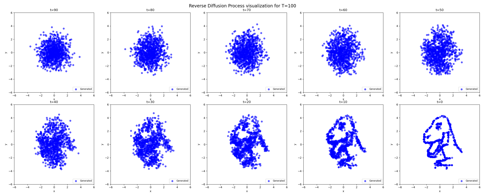
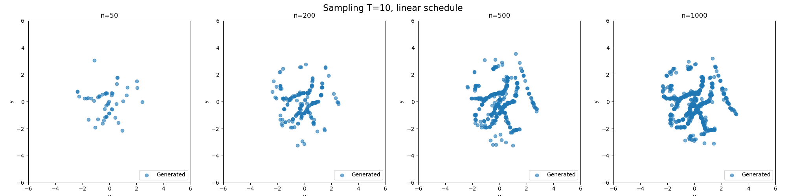
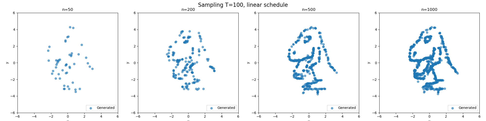
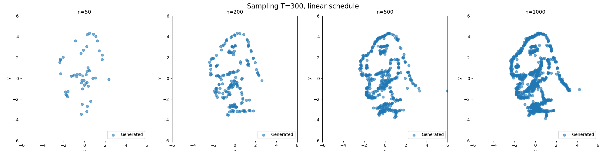
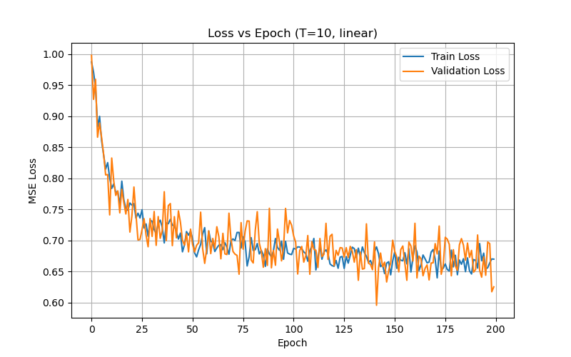
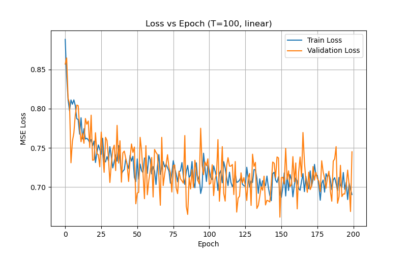
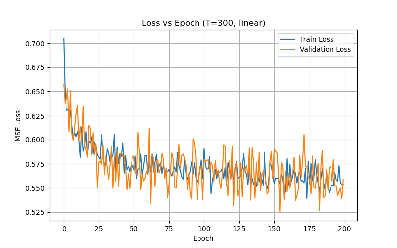
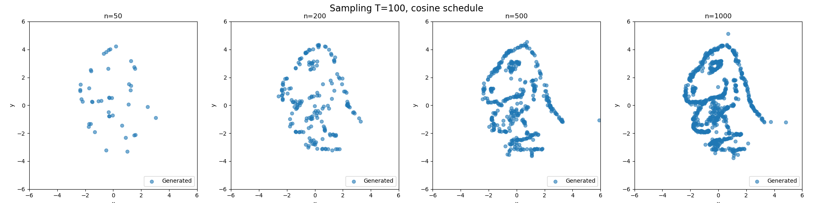
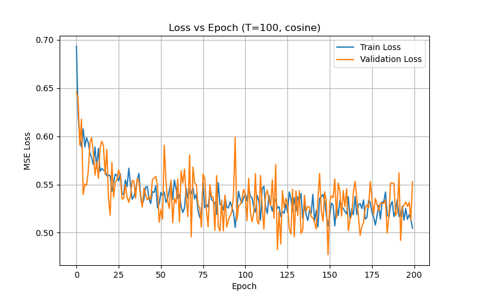

# Diffusion Models from Scratch

A detailed evaluation and experimentation project on Denoising Diffusion Probabilistic Models (DDPMs). This project builds upon the minimal implementation from the [`tiny-diffusion`](https://github.com/brianpulfer/tiny-diffusion) repository, applying the model to the "Dino" 2D dataset and extending the analysis with custom hyperparameter studies and schedules.

## Experimental Results & Findings

### 1. Reverse Diffusion Visualization
Visualizing the denoising process as the model reconstructs the underlying structure of the 2D Dino dataset step-by-step from pure noise.

### 2. Impact of Diffusion Timesteps (T)
I experimented with different lengths of the forward/reverse markov chain timesteps (T=10, 100, 300) to observe how the granularity of the noise addition and removal affects the final generation quality. A higher number of timesteps generally yields significantly better structural fidelity.

#### Generation Quality
- **T = 10**: The model struggles to capture fine details over such a short horizon and the generated structure remains quite diffuse.
  
- **T = 100**: The global structure forms clearly.
  
- **T = 300**: Generates the most highly detailed and continuous boundaries.
  

#### Training Convergence (Loss)
Longer schedules correspond with slightly different loss behaviors and convergence patterns.
- **T = 10 Loss**: 
  
- **T = 100 Loss**: 
  
- **T = 300 Loss**: 
  

### 3. Linear vs Cosine Noise Schedules
I implemented and tested a `cosine` noise schedule to compare against standard linear schedules. The cosine schedule often prevents the signal from being destroyed too completely in the early/mid forward diffusion steps, which can lead to improved generation stability and visual boundaries in the final sampling phase.

- **Cosine Schedule Sampling Results**: 
  
- **Cosine Schedule Loss Convergence**: 
  

## Acknowledgements 
The base model architecture is fundamentally derived and adapted from the [tiny-diffusion](https://github.com/brianpulfer/tiny-diffusion) repository by Brian Pulfer. The custom "Dino" toy dataset is part of the [Datasaurus Dozen](https://www.autodesk.com/research/publications/same-stats-different-graphs).
